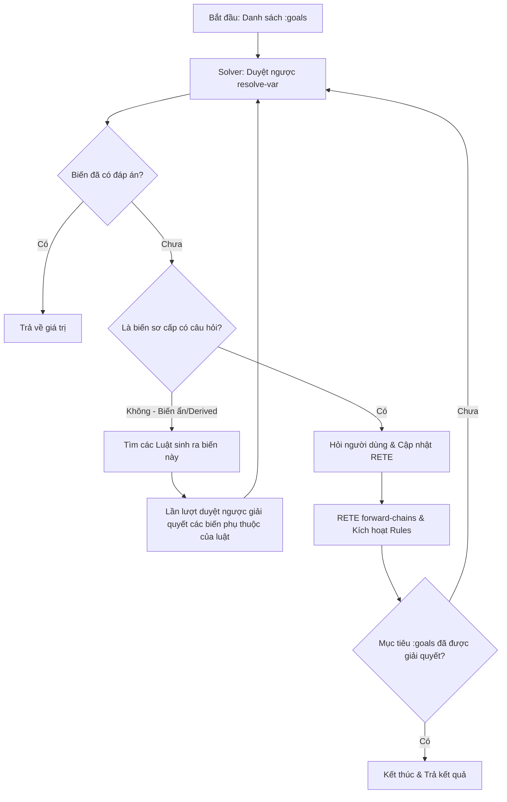

# Hướng Dẫn Viết EDN Form Dạng Luật Chuyên Gia (bb-form Expert System Guide)

Tài liệu này hướng dẫn chi tiết cách viết biểu mẫu cấu hình EDN tích hợp **Hệ Chuyên Gia (Expert System Mode)** sử dụng động cơ suy diễn RETE (`net.sekao/odoyle-rules`) và bộ giải ngược (`resolve-var`) trong `bb-form`.

---

## 1. Cấu Trúc Khai Báo Hệ Chuyên Gia

Để kích hoạt hệ chuyên gia, tệp tin EDN của bạn cần được cấu hình thuộc tính `:format :expert` (hoặc `:format "expert"`) và định nghĩa 2 thuộc tính cấp cao nhất sau:

```clojure
{;; 0. Kích hoạt chế độ hệ chuyên gia (mặc định là :normal)
 :format :expert

 ;; 1. Danh sách các biến mục tiêu cần đạt được kết luận cuối cùng
 :goals [:ket_luan_cu]

 ;; 2. Danh sách các luật suy diễn (Rules)
 :rules [ ... ]}
```

---

## 2. Cấu Trúc Chi Tiết Của Một Luật (Rule)

Mỗi luật là một map chứa các thuộc tính điều kiện (Left-Hand Side - LHS) và kết quả gán (Right-Hand Side - RHS):

```clojure
{:id       :id-luat-duy-nhat    ; (Keyword - Bắt buộc) Định danh của luật
 :priority muc-uu-tien          ; (Integer - Tùy chọn, mặc định 0) Mức ưu tiên khi giải quyết xung đột
 :require  [:bien1 :bien2]      ; (Vector Keyword - Tùy chọn) Danh sách biến bắt buộc phải giải quyết
 :if       [:bieu-thuc-logic]   ; (Vector - Tùy chọn) Điều kiện kích hoạt luật (LHS)
 :then     {:bien_muc_tieu gia_tri}} ; (Map - Bắt buộc) Kết quả gán khi luật thỏa mãn (RHS)
```

### Các Thành Phần của Luật:

#### A. `:id`
- Phải là một Keyword duy nhất trong toàn bộ biểu mẫu (ví dụ: `:rule-ngo-doc-noi-bo`).

#### B. `:priority`
- Xác định mức độ ưu tiên ghi đè giá trị. Khi nhiều luật đồng thời gán giá trị cho cùng một thuộc tính kết quả, **chỉ luật có `:priority` lớn nhất hoặc bằng** độ ưu tiên hiện tại mới được phép ghi đè giá trị đó vào phiên làm việc.
- Ví dụ:
  - Luật tính điểm cơ bản: `:priority 10`
  - Luật từ chối do nợ xấu (blacklist): `:priority 50` (ghi đè kết luận của luật cơ bản).

#### C. Tự động Nhận diện Phụ thuộc (No `:exists` needed)
- Hệ chuyên gia tự động quét toàn bộ biểu thức điều kiện `:if` và vế phải của `:then` để trích xuất tất cả các biến số được tham chiếu.
- Solver sẽ coi tất cả các biến này là biến phụ thuộc. Bạn **không cần** viết các kiểm tra rườm rà như `:if [:and [:exists :tuoi] [:exists :thu_nhap]]`. Hệ thống sẽ đảm bảo `:tuoi` và `:thu_nhap` đã được người dùng trả lời (không mang giá trị `:not-answered`) trước khi luật được đưa vào agenda để đánh giá.

#### D. Khối `:require`
- Dùng khi bạn muốn luật chỉ kích hoạt sau khi một danh sách các biến cụ thể đã được giải quyết, mặc dù các biến này không xuất hiện trực tiếp trong biểu thức của `:if` hay `:then`.
- Điển hình là các luật fallback (luật mặc định sau cùng) hoặc các luật trigger trung gian:
  ```clojure
  {:id :rule-nghi-pham-khong-ro
   :priority 5
   :require [:kieu_gay_an :dong_co_chinh]
   :then {:nghi_pham_chinh "Chưa xác định - cần điều tra thêm"}}
  ```

#### E. Biểu Thức `:if`
- Chứa các phép toán logic thông thường (`:and`, `:or`, `:not`, `:=`, `:<`, `:>`, v.v.).
- Nếu điều kiện `:if` được bỏ qua, luật sẽ tự động thỏa mãn ngay khi tất cả các biến phụ thuộc của nó đã được điền.

#### F. Kết Quả `:then`
- Map gán kết quả cho một biến mục tiêu hoặc biến ẩn trung gian. Vế phải có thể là hằng số hoặc một biểu thức tính toán động, hỗ trợ cú pháp gọi hàm namespace rút gọn (Shorthand Call) như:
  `{:diem_so [:loan/tinh-diem :thu_nhap :no_hien_tai]}` (thay vì cú pháp cũ: `[:call :loan/tinh-diem ...]`).

---

## 3. Cách Engine Phân Giải Luật (Execution & Resolution Flow)

Hệ chuyên gia chạy biểu mẫu thông qua 2 giai đoạn lồng nhau: **Duyệt Ngược (Backward-Chaining)** để xác định câu hỏi, và **Suy Diễn Tiến (Forward-Chaining)** để tính toán kết luận.



### 1. Thuật Toán Duyệt Ngược (`resolve-var`)
Khi cần tìm giá trị của một biến mục tiêu (ví dụ: `:ket_luan_vay`):
- Nếu biến đó đã có câu trả lời trong session, trả về giá trị đó.
- Nếu biến đó là biến sơ cấp (có cấu hình field hỏi người dùng trong `:fields`):
    - Đánh giá điều kiện `:show-if` của field đó.
    - Nếu `:show-if` thỏa mãn, tiến hành hiển thị câu hỏi cho người dùng nhập, nạp giá trị vào O'Doyle RETE session, và kích hoạt suy diễn tiến.
- Nếu biến đó là biến ẩn trung gian (derived variable) được sinh ra từ các luật:
    - Tìm toàn bộ các luật có `:then` gán cho biến này.
    - Sắp xếp các luật theo thứ tự `:priority` giảm dần.
    - Với mỗi luật, đệ quy gọi `resolve-var` để giải quyết các biến phụ thuộc của luật đó (trong `:if`, `:then` và `:require`).
    - Nếu các biến phụ thuộc của luật thỏa mãn, luật sẽ kích hoạt gán giá trị cho biến trung gian.

### 2. Cắt Tỉa Câu Hỏi (Pruning/Short-circuiting)
Trong quá trình giải quyết biểu thức điều kiện `:if` của luật, solver sử dụng cơ chế **đánh giá động nhánh tích cực (Active Branch Evaluation)**:
- Ở toán tử logic `[:or A B]`, nếu `A` đã được giải quyết và trả về `true`, solver lập tức bỏ qua và không bao giờ hỏi các câu hỏi liên quan đến `B`.
- Ở toán tử logic `[:and A B]`, nếu `A` trả về `false`, solver lập tức bỏ qua `B`.
- Ở toán tử rẽ nhánh `[:if điều_kiện nhánh_đúng nhánh_sai]`, solver sẽ đánh giá `điều_kiện`. Nếu `điều_kiện` chưa thể giải quyết (Unknown), nó sẽ yêu cầu nhập biến cho `điều_kiện` trước. Khi `điều_kiện` đã rõ ràng (ví dụ: `true`), nó chỉ đi sâu giải quyết các biến nằm trong `nhánh_đúng` và bỏ qua hoàn toàn các câu hỏi trong `nhánh_sai`.

---

## 4. Ví Dụ Thực Tế & Phân Tích Luồng Chạy

Dưới đây là một phần cấu hình của biểu mẫu chẩn đoán sản khoa `sanh-expert.edn`:

```clojure
{:title "Chẩn đoán Sản khoa chuyên gia"
 :goals [:sanh_ket_luan]
 :import [["../formulas/sanh_utils.clj" :as :sanh]]
 
 :fields
 [{:id :ngoi_thai
   :label "Ngôi thai là gì?"
   :type :select
   :options ["Đầu" "Mông" "Ngang"]
   :required true}
  {:id :khung_chau
   :label "Khung chậu người mẹ?"
   :type :select
   :options ["Bình thường" "Hẹp" "Giới hạn"]
   :required true}
  {:id :tinh_trang_oi
   :label "Tình trạng ối?"
   :type :select
   :options ["Còn" "Đã vỡ"]
   :required true}
  {:id :gio_vo_oi
   :label "Giờ vỡ ối?"
   :type :datetime
   :show-if [:= :tinh_trang_oi "Đã vỡ"]}]
   
 :rules
 [;; Luật 1: Ngôi ngang -> Mổ khẩn cấp lập tức (Priority cao)
  {:id :rule-ngoi-ngang
   :priority 100
   :if [:= :ngoi_thai "Ngang"]
   :then {:sanh_ket_luan "🔴 CHỈ ĐỊNH MỔ KHẨN CẤP: Ngôi thai ngang không thể đẻ thường."}}

  ;; Luật 2: Khung chậu hẹp -> Mổ lấy thai
  {:id :rule-khung-chau-hep
   :priority 90
   :if [:= :khung_chau "Hẹp"]
   :then {:sanh_ket_luan "🔴 CHỈ ĐỊNH MỔ LẤY THAI: Bất tương xứng đầu chậu."}}

  ;; Luật 3: Ối vỡ lâu > 12 giờ -> Mổ + Kháng sinh
  {:id :rule-oi-vo-lau
   :priority 80
   :if [:and [:= :tinh_trang_oi "Đã vỡ"]
             [:> [:sanh/tinh-gio-vo-oi :gio_vo_oi] 12]]
   :then {:sanh_ket_luan "🔴 CHỈ ĐỊNH MỔ + KHÁNG SINH: Nguy cơ nhiễm trùng ối do vỡ lâu."}}
 ]
}
```

### Phân Tích Luồng Chạy:
1. **Bắt đầu**: Hệ thống nhận mục tiêu `:sanh_ket_luan`. Nó quét qua các luật sinh ra mục tiêu này: `rule-ngoi-ngang`, `rule-khung-chau-hep`, `rule-oi-vo-lau`.
2. **Luật 1 (rule-ngoi-ngang)**: Có mức ưu tiên cao nhất (`100`). Biến phụ thuộc là `:ngoi_thai`. Hệ thống hỏi câu hỏi: `"Ngôi thai là gì?"`.
3. **Kịch bản A (Người dùng chọn "Ngang")**:
   - O'Doyle RETE ghi nhận `:ngoi_thai` là `"Ngang"`.
   - `rule-ngoi-ngang` thỏa mãn điều kiện `:if` -> thực thi `:then` gán `:sanh_ket_luan` bằng `"🔴 CHỈ ĐỊNH MỔ KHẨN CẤP..."`.
   - Mục tiêu `:sanh_ket_luan` đã được giải quyết. Hệ thống **lập tức kết thúc** chương trình và in ra kết luận. Người dùng **không phải trả lời** bất kỳ câu hỏi nào về `khung_chau` hay `tinh_trang_oi`.
4. **Kịch bản B (Người dùng chọn "Đầu")**:
   - `rule-ngoi-ngang` thất bại. Hệ thống chuyển sang Luật 2 (`rule-khung-chau-hep`, priority `90`).
   - Biến phụ thuộc là `:khung_chau`. Hệ thống hiển thị câu hỏi: `"Khung chậu người mẹ?"`.
   - Nếu người dùng chọn `"Hẹp"`, `rule-khung-chau-hep` thỏa mãn -> kết luận mổ -> kết thúc.
   - Nếu người dùng chọn `"Bình thường"`, hệ thống chuyển tiếp sang Luật 3 (`rule-oi-vo-lau`, priority `80`).
   - Biến phụ thuộc của Luật 3 là `:tinh_trang_oi`. Hệ thống hỏi `"Tình trạng ối?"`.
   - Nếu người dùng chọn `"Còn"`:
     - Biểu thức logic `[:and [:= :tinh_trang_oi "Đã vỡ"] ...]` lập tức trả về `false` vì nhánh đầu tiên sai.
     - Nhờ cơ chế cắt tỉa, hệ thống **bỏ qua hoàn toàn** và không bao giờ hỏi câu hỏi `"Giờ vỡ ối?"` (`:gio_vo_oi`) mặc dù nó nằm trong công thức của luật.
