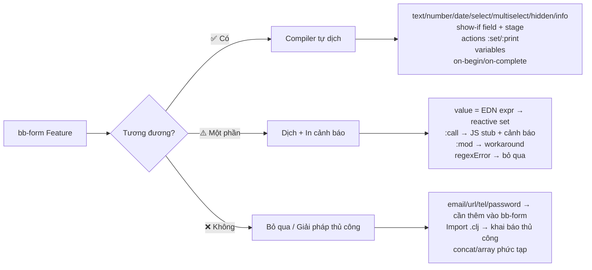

# So sánh Thành phần Form: bb-form ↔ formsmd

---

## 1. Các loại trường nhập liệu (Input Types)

| bb-form type (`:type`) | formsmd Constructor | Ghi chú / Phương án dung hòa |
|:---|:---|:---|
| `:text` | `TextInput` | ✅ Ánh xạ trực tiếp |
| `:number` | `NumberInput` | ✅ Ánh xạ trực tiếp |
| `:date` | `DateInput` | ✅ Ánh xạ trực tiếp |
| `:select` | `SelectBox` | ✅ Ánh xạ trực tiếp (menu thả xuống) |
| `:radio` | `ChoiceInput` | ✅ Ánh xạ → `ChoiceInput` (radio mode, mặc định single-select) |
| `:multiselect` | `ChoiceInput` + `\| multiple = true` | ✅ Ánh xạ với tham số `multiple = true` |
| `:hidden` | `:::` reactive block + `` | ✅ Ánh xạ thành reactive block Nunjucks |
| `:info` | Văn bản Markdown thuần | ✅ Ánh xạ thành đoạn văn/heading không có field |
| *(không có)* | `EmailInput` | ⚠️ **formsmd có, bb-form thiếu** → Cần thêm `:email` vào bb-form |
| *(không có)* | `URLInput` | ⚠️ **formsmd có, bb-form thiếu** → Cần thêm `:url` |
| *(không có)* | `TelInput` | ⚠️ **formsmd có, bb-form thiếu** → Cần thêm `:tel` |
| *(không có)* | `PasswordInput` | ⚠️ **formsmd có, bb-form thiếu** |
| *(không có)* | `DatetimeInput` | ⚠️ **formsmd có, bb-form thiếu** → Có thể ánh xạ từ `:date` với flag |
| *(không có)* | `TimeInput` | ⚠️ **formsmd có, bb-form thiếu** |
| *(không có)* | `RatingInput` | ⚠️ **formsmd có, bb-form thiếu** |
| *(không có)* | `OpinionScale` | ⚠️ **formsmd có, bb-form thiếu** |
| *(không có)* | `PictureChoice` | ⚠️ **formsmd có, bb-form thiếu** (cần hỗ trợ `:images`) |
| *(không có)* | `FileInput` | ⚠️ **formsmd có, bb-form thiếu** (khó ánh xạ — dùng web) |

---

## 2. Thuộc tính cấu hình của một Field

| Thuộc tính trong bb-form | Tham số formsmd | Phương án dung hòa |
|:---|:---|:---|
| `:id` | Tên biến trước `=` | ✅ Ánh xạ trực tiếp |
| `:label` | `\| question = ...` | ✅ Ánh xạ trực tiếp |
| `:required true` | Dấu `*` sau tên biến | ✅ Ánh xạ trực tiếp |
| `:description "..."` | `\| description = ...` | ✅ Ánh xạ trực tiếp |
| `:placeholder "..."` | `\| placeholder = ...` | ✅ Ánh xạ trực tiếp |
| `:options [...]` | `\| choices = A, B, C` | ✅ Join bằng dấu phẩy |
| `:value <expr>` | `\| value = <literal>` | ⚠️ formsmd chỉ nhận **giá trị tĩnh**. Nếu là biểu thức EDN → dùng reactive `` |
| `:min` / `:max` / `:step` | `\| min = ` / `\| max = ` / `\| step = ` | ✅ Ánh xạ trực tiếp |
| `:regex "pattern"` | `\| pattern = ...` | ✅ Ánh xạ trực tiếp |
| `:regexError "msg"` | *(không có tham số tương đương)* | ❌ **bb-form có, formsmd thiếu** → Bỏ qua khi xuất |
| `:show-if <expr>` | Reactive block `` xung quanh field | ✅ Ánh xạ thành conditional reactive block |
| `:actions [...]` | Reactive block `` triggered by field | ✅ Ánh xạ thành reactive block theo dõi biến field |
| `:label [vec]` (conditional text) | Reactive block với `` | ✅ Ánh xạ thành reactive label |

---

## 3. Cấu trúc Stages & Slides

| Khái niệm bb-form | Khái niệm formsmd | Phương án dung hòa |
|:---|:---|:---|
| `:stages [...]` | Các slides phân tách bằng `---` | ✅ Mỗi stage → một slide |
| `:on-begin [actions]` | Reactive block ở đầu slide (không có dep) | ✅ Dùng reactive block `:::` không có deps để in thông báo |
| `:on-complete [actions]` | Reactive block ở cuối slide | ✅ Tương tự, nhưng **bị giới hạn** vì formsmd không có hook rõ ràng |
| `:show-if <expr>` ở Stage | **Jump condition**: `-> conditionExpr` sau `---` | ✅ Slide sẽ tự động bị bỏ qua nếu điều kiện sai |
| Restarting Loop (quét lại từ đầu) | Reactive bindings tự động cập nhật khi dep thay đổi | ✅ Tương đương — formsmd dùng data binding thời gian thực |
| `[:print "msg"]` trong actions | `
📢 msg
` trong reactive block | ✅ Ánh xạ thành HTML paragraph |
| `[:set :var expr]` trong actions | `` trong reactive block | ✅ Ánh xạ trực tiếp |

---

## 4. Global Variables

| Khái niệm bb-form | Khái niệm formsmd | Phương án dung hòa |
|:---|:---|:---|
| `:variables {:ten val}` (global) | Không có tương đương native | ✅ Dùng `` bên trong `:::` no-dep reactive block ở đầu template |
| Biến toàn cục tồn tại xuyên stage | Nunjucks variable tồn tại trong toàn bộ template | ✅ Tương đương — Nunjucks scoping phẳng |
| Biến bị reset khi chuyển Stage | Không có cơ chế reset | ❌ Khác biệt — formsmd không có scoping theo stage |

---

## 5. Logic Engine & Biểu thức

| bb-form (EDN DSL) | formsmd (Nunjucks) | Phương án dung hòa |
|:---|:---|:---|
| `[:= [:var :x] "abc"]` | `x == "abc"` | ✅ `compile-expr` dịch tự động |
| `[:and cond1 cond2]` | `(cond1) and (cond2)` | ✅ Nunjucks dùng `and` thay vì `&&` |
| `[:or cond1 cond2]` | `(cond1) or (cond2)` | ✅ Nunjucks dùng `or` |
| `[:not cond]` | `not (cond)` | ✅ |
| `[:> [:var :x] 10]` | `(x > 10)` | ✅ |
| `[:if cond a b]` | `(cond ? a : b)` | ✅ Ternary JS |
| `[:+ a b]`, `[:* a b]` | `(a + b)`, `(a * b)` | ✅ |
| `[:contains? coll item]` | `coll contains item` | ✅ Nunjucks syntax |
| `[:count coll]` | `(coll \| length)` | ✅ Nunjucks filter |
| `[:str/lower-case x]` | `(x \| lower)` | ✅ Nunjucks filter |
| `[:call :ns/fn arg1]` | `ns.fn(arg1)` gọi từ `window` | ⚠️ **Cần khai báo thủ công hàm JS trên `window`** — in cảnh báo |
| `[:mod a b]` | *(không có built-in Nunjucks)* | ❌ **bb-form có, formsmd thiếu** → Workaround với `(a - (a / b \| int) * b)` |
| `[:concat arr1 arr2]` | *(không có built-in)* | ❌ Không hỗ trợ trong formsmd |
| `[:array a b c]` | `[a, b, c]` (Nunjucks array literal) | ✅ có thể dùng literal |
| `[:call :ns/fn ...]` phức tạp | ⚠️ In cảnh báo, giữ nguyên call stub | ⚠️ **Chỉ chạy nếu dev khai báo JS trên window** |

---

## 6. Tính năng Import & Công thức

| bb-form | formsmd | Phương án dung hòa |
|:---|:---|:---|
| `:import ["file.clj" :as :ns]` | Không có hệ thống import | ⚠️ **Không tương đương** — Cần khai báo hàm JS thủ công trong `<script>` của HTML |
| `.clj` Clojure functions | JS function trên `window` | ⚠️ Compiler in cảnh báo + để stub JS |
| `.edn` EDN formula | JS object `window.ns = { fn: ... }` | ⚠️ Tương lai có thể tự động dịch EDN formula đơn giản |

---

## 7. Tính năng Đặc thù

| Tính năng bb-form | formsmd tương đương | Phương án dung hòa |
|:---|:---|:---|
| Chạy terminal TUI | Không có | ❌ Hai hệ thống hoàn toàn khác môi trường |
| Export JSON/EDN | Submit qua POST URL | ⚠️ Khác nhau về cơ chế output |
| `--values file.edn` (prefill) | URL params / `saveState` | ⚠️ Không tương đương trực tiếp |
| Multi-engine (gum/tui/web) | Chỉ web | ✅ formsmd là web engine của bb-form |
| `-> start -> ButtonText` | `-> start -> Bắt đầu` | ✅ Chuẩn formsmd markdown-like |
| `-> end` | `-> end` | ✅ Tương đương |
| Inline interpolation `{{var}}` | `{$ var $}` (ngoài reactive) / `{{ var }}` (trong Nunjucks) | ✅ Compiler tự dịch |
| Conditional label `[{:text "..." :show-if ...}]` | Reactive block ` text  text ` | ✅ `compile-vector-label` |

---

## 8. Tóm tắt Khoảng cách & Ưu tiên xử lý

> [!IMPORTANT]
> **Ưu tiên bổ sung vào bb-form** để tăng khả năng xuất sang formsmd:
> 1. Thêm các type: `:email`, `:url`, `:tel`, `:password`, `:datetime`, `:time`, `:rating`, `:opinion-scale`, `:picture-choice`, `:file`
> 2. Thêm thuộc tính `:subfield` (formsmd hỗ trợ `| subfield`) cho các field lồng nhau
> 3. Thêm thuộc tính `:unit-end` / `:unit-start` (formsmd: `| unitend = $`)

> [!TIP]
> **Quy trình export hiện tại đã ổn định cho:**
> - Form nhiều bước có rẽ nhánh field-level (`show-if`)
> - Form nhiều stage có jump condition (`show-if` trên stage)
> - Biến ẩn tính toán (`hidden` + `value`)
> - Actions thay đổi biến sau khi trả lời (`actions`)
> - Global variables
> - Conditional text labels
